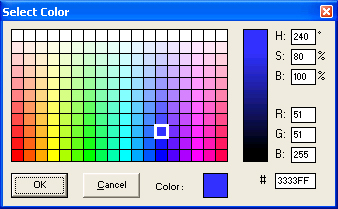

<div align="center">

## A Color Picker that works \( ocx \)


</div>

### Description

This is a Color Picker, and provides and easy, yet powerful way of picking any color. I've developed it as an ActiveX Control (ocx), and is just as easy to use within your code as the MS-Common Dialog Color Picker.
 
### More Info
 
There's only one Function that the developer need to use, which is the ShowColor()- function. Here you can throw 2 optional arguments; 1 : The title of the Dialog, 2 : Any default color you want to be displayed

Install :

1. Compile the code into an ocx

2. Add this ocx as an component within your app

Usage (Example) :

Private Sub ChangeBGColor()

Dim myColor As Long

'ctrColorPicker is the name of the OCX

myColor = ctrColorPicker.ShowColor("Select a color", vbRed)

'This Control returns -1 if user cancel the

'dialog, so we must make sure the value is

'greater than -1

If myColor > 0 Then txtText.BackColor = myColor

End Sub

The function returns a Long, which is the VB-internal Color


<span>             |<span>
---                |---
**Submitted On**   |2004-09-12 12:21:24
**By**             |[David Gabrielsen 2](https://github.com/Planet-Source-Code/PSCIndex/blob/master/ByAuthor/david-gabrielsen-2.md)
**Level**          |Intermediate
**User Rating**    |4.8 (19 globes from 4 users)
**Compatibility**  |VB 6\.0
**Category**       |[OLE/ COM/ DCOM/ Active\-X](https://github.com/Planet-Source-Code/PSCIndex/blob/master/ByCategory/ole-com-dcom-active-x__1-29.md)
**World**          |[Visual Basic](https://github.com/Planet-Source-Code/PSCIndex/blob/master/ByWorld/visual-basic.md)
**Archive File**   |[An\_Color\_P1792479122004\.zip](https://github.com/Planet-Source-Code/david-gabrielsen-2-a-color-picker-that-works-ocx__1-56140/archive/master.zip)

### API Declarations

```
'Install :
'1. Compile the code into an ocx
'2. Add this ocx as an component within your app
'Usage (Example) :
Private Sub ChangeBGColor()
 Dim myColor As Long
 'ctrColorPicker is the name of the OCX
 myColor = ctrColorPicker.ShowColor("Select a color", vbRed)
 'This Control returns -1 if user cancel the
 'dialog, so we must make sure the value is
 'greater than -1
 If myColor > -1 Then txtText.BackColor = myColor
End Sub
'There's only one Function that the developer need
'to use, which is the ShowColor()- function. Here
'you can throw 2 optional arguments; 1 : The title
'of the Dialog, 2 : Any default color you want to
'be displayed
```


